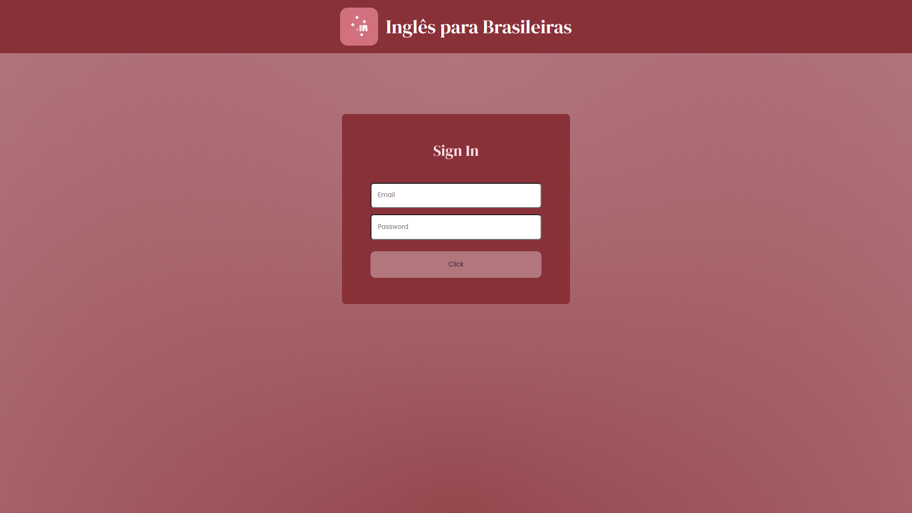
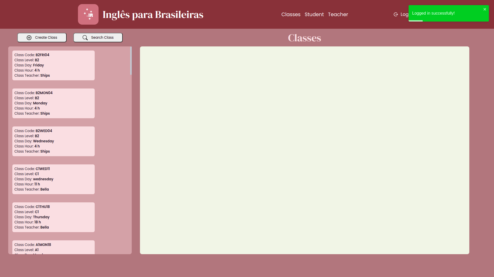
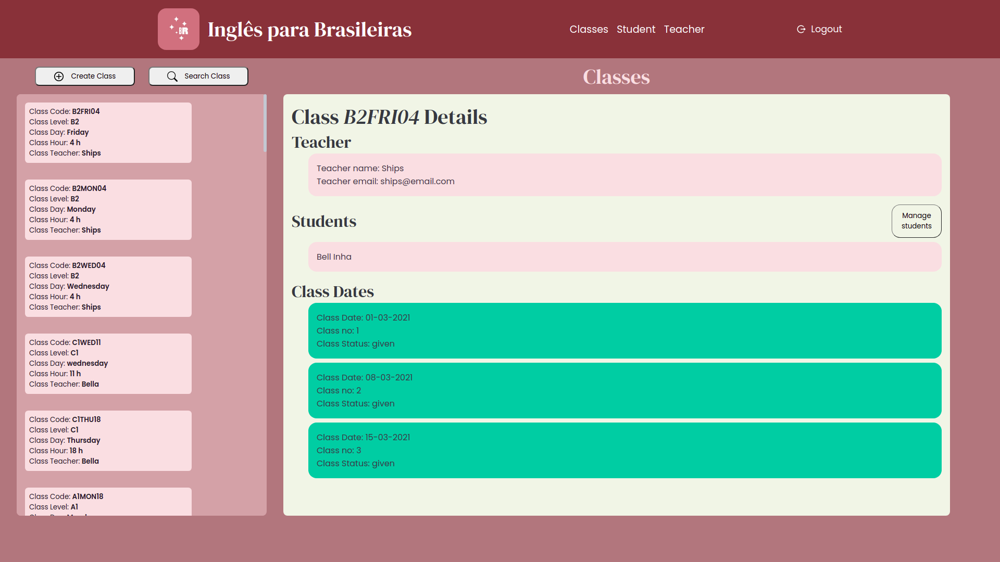
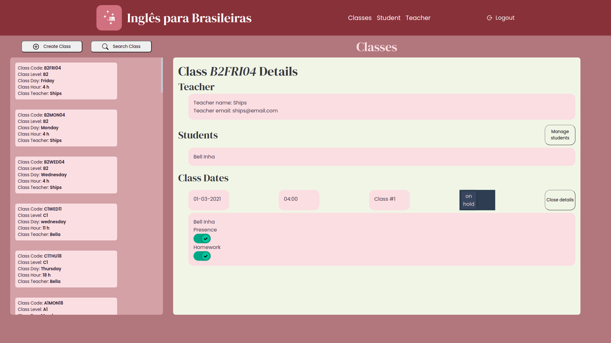
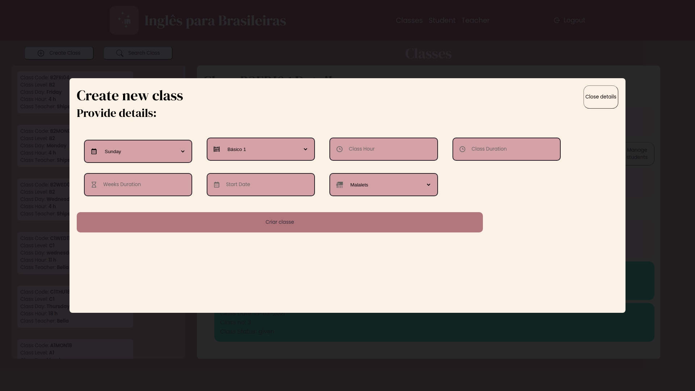

# igbr frontend (React.js)

Project under development

## Technology

- Javascript with Typescript
- ReactJs library

## Concepts and technologies applied in this project:

- Abstract the application into components
- Use of context to share data throughout the pages
- Password encryption
- Input data validation
- Integration with REST API
- CSS and Styled-components

## Features ready

> Classes
[x] Create class
  [x] Using modal
  [x] After created, offer option to display created class - create function to allow setting all data and unset the modal
  [x] Fields with dropdown options
[x] Filter and List classes
[x] Section Class Details
  [x] Section should be refreshed after any update
    [x] Option to manage students in this class
      [x] Search students by name
      [x] show if student is already in another class - alert to confirm if his class should be changed
  [x] Modal Class Date Details
    [x] Status can be updated
    [x] List students
    [x] Should be able to update presence and homework
    [x] Should be able to update class status

## Pending Features

> Students
[ ] Create student
[ ] Filter and List students
[ ] Modal Student Details
  [ ] Show student data
  [ ] Allow changes on student data
  [ ] List classes timetables
    [ ] Allow update presence and homework

> Teacher
[ ] Create class
[ ] List classes

## List of pages

### Login

### Dashboard

### Class Details

### Class Details - Updating status

### Modal Create Class

## List of services used in the application

| Name | Type | Description | Endpoint |
| ------------------- | ------------------- | ------------------- | ------------------- |
|  Teachers | `POST` | Create teacher | `hostURL`/teacher |
|  Teachers | `POST` | Authenticate teacher | `hostURL`/teacher/sessions |
|  Teachers | `GET` | List teachers | `hostURL`/teacher |
|  Classes | `POST` | Create Class | `hostURL`/classes |
|  Classes | `PATCH` | Update Class Timetable Status | `hostURL`/classes/`:id`/set_status |
|  Classes | `GET` | List classes | `hostURL`/classes |
|  Classes | `GET` | Class Details | `hostURL`/classes/`:id`/details |
|  Students | `GET` | List students | `hostURL`/students |
|  Students | `PATCH` | Update Student Data | `hostURL`/students/`:id` |
|  Students | `PATCH` | Update Student Class Info | `hostURL`/students/`:id`/set_status |
|  Students | `POST` | Authenticate Student | `hostURL`/students/sessions |
|  Students | `POST` | Create student | `hostURL`/students |

